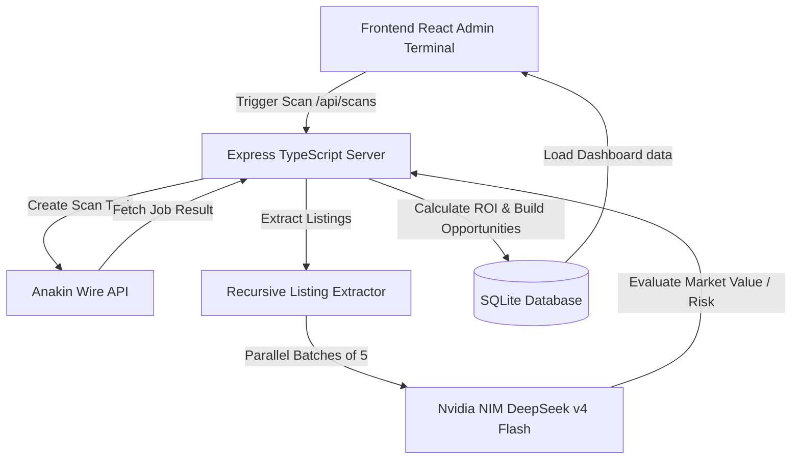

# User Guide - AI Arbitrage Engine Terminal

Welcome to the **AI Arbitrage Engine**! This guide will walk you through setting up, configuring, running, and presenting the application.

---

## 🏗️ Architecture & Pipeline Flow

The AI Arbitrage Engine is a high-performance arbitrage scanning platform designed with the following stack:



---

## ⚙️ Configuration Setup

All project configuration is defined in the [`.env`](file:///c:/ai-arb/.env) file located in the project root. Ensure you have the following environment variables set:

```env
PORT=8787
SCAN_INTERVAL_SECONDS=120

# Anakin Wire Data Acquisition Configuration
ANAKIN_WIRE_BASE_URL=https://api.anakin.io/v1/wire
ANAKIN_API_KEY=your_anakin_api_key_here
ANAKIN_ACTION_ID=am_search_products
ANAKIN_SEARCH_PARAMS_JSON={"query":"used camera","page":1,"limit":24,"sort":"featured"}

# Nvidia NIM AI Reasoner Configuration
NVIDIA_NIM_API_KEY=your_nvidia_nim_key_here
NVIDIA_NIM_BASE_URL=https://integrate.api.nvidia.com/v1
DEEPSEEK_MODEL=deepseek-ai/deepseek-v4-flash

# Database path
DATABASE_PATH=data/ai-arb.sqlite
```

---

## 🚀 Running the Project

### 1. Install Dependencies
If you haven't already, run this in the terminal:
```bash
npm install
```

### 2. Start in Development Mode
To run both the backend server and the client frontend server concurrently in watch mode:
```bash
npm run dev
```
* The **Frontend React Terminal** will be available at: **[http://127.0.0.1:5173/](http://127.0.0.1:5173/)**
* The **Backend Express API** will run at: **[http://127.0.0.1:8787](http://127.0.0.1:8787)**

### 3. Build & Run in Production
To compile TypeScript and build the static frontend assets:
```bash
npm run build
npm start
```

---

## 🧪 Testing the Codebase

To run unit and integration tests (powered by Vitest):
```bash
npm test
```

---

## 🛠️ Tracing & Troubleshooting

We have integrated high-visibility trace logs inside the server process. If a scan is triggered, you should see the following sequence printed in the console:

1. **`⚡ [SCAN ROUTE] Lock Acquired`** — The API router locks the endpoint so multiple scans cannot overlap.
2. **`📡 [WIRE SERVICE] Task Dispatched -> Job ID Registered: [ID]`** — The Anakin Wire scraping job has successfully started.
3. **`📦 [DEEPSEEK] Split [N] listings into [M] batches of size 5`** — The engine splits product lists to respect gateway timeout limits.
4. **`🤖 [DEEPSEEK] Dispatching payload to Nvidia NIM`** — Appraisal payloads are dispatched in parallel to the AI reasoning engine.
5. **`🔓 [SCAN ROUTE] Lock Automatically Released`** — The scan completes, the lock is released, and database states are committed.

### Common Troubleshooting Scenarios:
* **"NVIDIA NIM appraisal failed: 404 Model Not Found"**
  * *Reason*: The model configured in `.env` is either misspelled or unauthorized for your key.
  * *Solution*: Ensure `DEEPSEEK_MODEL=deepseek-ai/deepseek-v4-flash` is used.
* **"A scan is already running" (409 status code)**
  * *Reason*: A scan was already triggered and is currently polling Anakin Wire or querying NIM.
  * *Solution*: The route state lock automatically cleans up on completion, failure, or if the client connection drops (using standard request abort hooks). Wait a few moments for the current scan to finish.
